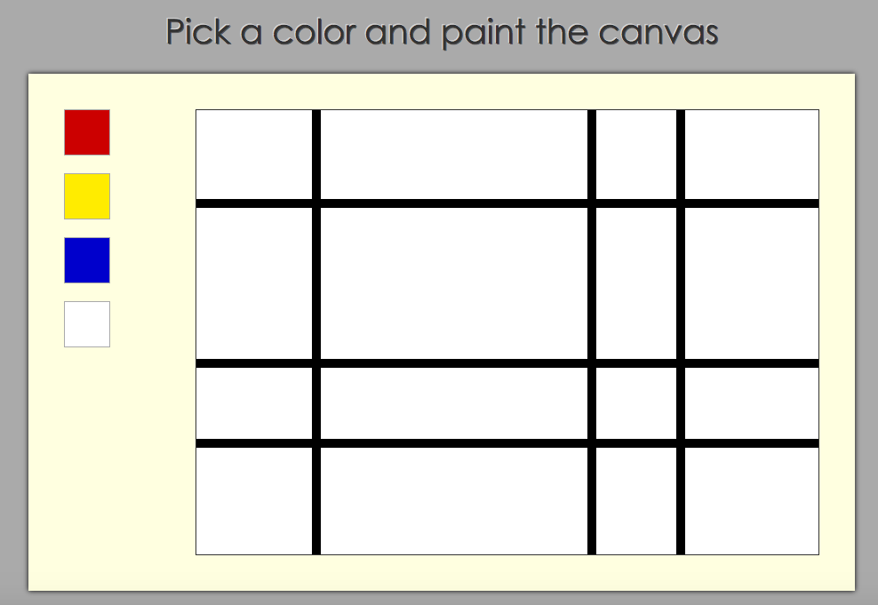

Piet Mondrian is best known for his simple and elegent paintings using bold colors and uncomplicated rectangles. His use of abstraction and asymmetrical design became highly influential in the development of modrn art.

<figure>
	
	<figcaption>Piet Mondrian's Composition with large red plane yellow black gray and blue. Courtesy of <a href="http://www.piet-mondrian.org">piet-mondrian.org</a>.</figcaption>
</figure>

A simplified version of a mondrian painting is a great tool for a beginning developer to use to learn the communication between the back-end storage of information and the front end displaying of a piece of the information.

### Goals of the website
The overal goals of the website were three fold:
1. We would like to be able to paint a mondrian by selecting a color and clicking a box to paint that color.
2. We would like to be able to save our new creation
3. We would like to be able to view any saved paintings
The goals of this website were designed to learn AJAX and JSON.

### Set-up
Because our goal is to learn AJAX and JSON and not to learn CSS and HTML. We begin our project with the outline of our painting and a painting palette.
<figure>
	
</figure>
The small boxes on the left are our palette.

### Goal 1: Painting
We would like to be able to click on one of the boxes in the palette to choose a color and then be able to paint that color onto one of the rectangles in the painting. We will do this in two parts: First, we will make event listeners for the palette to choose the color. Second, we will make event listeners for the each rectangle of the painting in order to change it to the selected color.

What's an event listener you ask? In javascript, we add event listeners to control the timing of events. We use addEventListener() to do this. This method is used by calling it on an element in the DOM:  When the event occurs on myDOMElement, the function will be run. Want to learn more about this? Check out the DOM event tutorial.

Let's get started! We would like to click on a box in the palette and remember the color. Therefore, we're going to make an event listener for each box in our pallete. They conveniently are all the same color class, and we can use a loop.
	

Our event listeners call on the function chooseColor, which looks at what color the box that was clicked on is and sets that as the current color.

Next we would like to use the current color to paint a rectangle in the painting. In order to do that we need to make an event listener for each rectangle, which conveniently all have the same row class.

The event listeners call the function setColor, which changes the background color of the rectangle that was clicked to the current color.

### Goal 2: Saving
So you've made a masterpiece and you don't want to lose it? We'll save the information to a server-side database.The first thing we need to do is create a query string to send along with our POST request.

Our query string has the notation of key=value with a ? to indicate the start of the query and a &amp in between query pairs. I have decided to save the paintings using the date it was saved in epoch time as a unique identifier. Our key for each rectangle is the unique id identifying it. Our value is the color, to simplify I convert the rgb color into a color word (red, blue, yellow or white) using a previously defined hash. We loop through all of the rectangles adding to our querystring. Therefore, our querystring contains a key/value pair for the date and one for each rectangle in the painting.

We use a post request to send the query information to the server-side to be saved. If you want to learn more about post and get requests, check out my tutorial focused on them. In our ruby controller, we have defined a get /savenew to recieve the request from the client.

Additionally, we'd like to add our newly saved painting to the list of saved paintings appearing on the screen. We'll get back to this when we discuss displaying all of the saved paintings on the screen below.

The next piece to understanding how to save the paintings is what happens on the server-side. So, far we have sent the information in the form of a querystring to the appropriate ruby controller. In this ruby controller we call on a function that will parse the param data and add it to our database, which is a csv file.

Hooray! Now our beautiful masterpiece is saved!

### Goal 3: Displaying saved paintings
Our next goal is to be able to display a saved painting. In order to do this, we need a way to select which painting to display. We will first display a list of all the saved paintings.